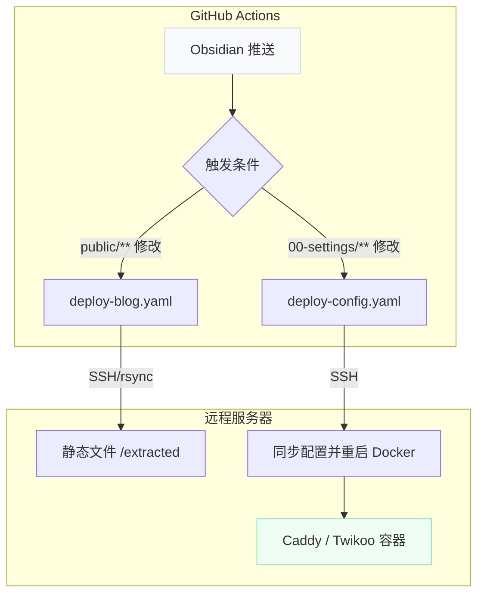

# 前言

最近把远程服务器的服务迁移到了新环境，希望尽可能的 [IaC 化](../../知识库/名词/Infrastructure%20as%20Code.md)。

# 迁移前的架构

## 服务管理混乱

服务器上跑了一堆东西，有的用 Systemd，有的用 Docker，管理起来很麻烦：

- **Caddy**：Systemd 服务，反向代理 + HTTPS
- **Twikoo**：Docker 容器，评论系统
- **Go Upload**：Systemd 服务，文件上传
- **其他琐碎小服务**：散落在各处的 Systemd 配置或脚本任务（非核心服务）

每次要重启服务都得想一下，这个是 `systemctl restart` 还是 `docker restart`，很容易搞混，而且迁移服务器或者主备切换的时候经常出现服务遗漏。

## 部署链路过长

之前的部署流程是这样的：


**问题在哪？**

1. 依赖 Go Upload 这个中间服务，多了一个故障点
2. 部署链路太长，出问题不好排查
3. Go Upload 还得单独维护，增加了运维成本（<- 其实主要是这条，我不想单独维护一个包了）


# 迁移后的架构

## 琐碎服务的归口管理

以前最头疼的就是那些“顺手写的”脚本和 Systemd 配置，时间长了根本记不住在哪。

这次迁移把这些琐碎服务全部按照功能模块化，每个模块都是一个标准的项目目录：

```bash
.
├── 01-blog/           # 博客核心服务 (Caddy, Twikoo)
├── 02-tools/          # 个人工具集 (脚本任务容器化)
└── 03-tasks/          # 各类定时任务与功能性小脚本（容器化运行）
```

所有的微小服务现在都以 Docker 容器的形式运行，并通过 `docker-compose.yaml` 进行统筹。这意味着：
- **配置即项目**：不再有全局散落的脚本。
- **环境隔离**：每个“小服务”都有自己的依赖环境，互不干扰。
- **生命周期统一**：和核心服务一样，享受一键启停和日志管理。

## 全面容器化

这次直接把所有服务都塞进 Docker Compose 里（这里只展示一部分核心结构，不包含全部配置）：

```yaml
version: "3.8"

services:
  caddy:
    image: caddy:alpine
    container_name: caddy
    restart: unless-stopped
    ports:
      - "80:80"
      - "443:443"
      - "443:443/udp"
    volumes:
      - ./caddy/Caddyfile:/etc/caddy/Caddyfile:ro
      - ./caddy/data:/data
      - ./caddy/config:/config
      - /extracted:/var/www/blog:ro

  twikoo:
    image: imaegoo/twikoo:latest
    container_name: twikoo
    restart: unless-stopped
    ports:
      - "8080:8080"
    environment:
      - TWIKOO_THROTTLE=1000
    volumes:
      - ./data/twikoo:/app/data
```

**好处是什么？**

1. **本地测试即生产环境**：本地 `docker compose up` 跑通了，服务器上就没问题
2. **一键启停**：不用再记哪个是 systemd 哪个是 docker 了
3. **配置版本化**：所有配置都在 Git 里，想回滚随时回滚
4. **隔离性**：每个服务都有自己的容器，互不干扰

> [!tip] 技巧：利用 *.localhost 进行本地语义化调试
> 现代浏览器会将 `*.localhost` 自动解析到 `127.0.0.1`，免去了修改 `hosts` 的麻烦。
> **注意**：若在 Docker 容器中使用 HTTPS，需手动将容器映射出来的 `root.crt` 导入 Mac 钥匙串并勾选“始终信任”，或直接在测试环境使用 `http://` 协议以绕过证书问题。


## 精简部署链路

新的部署流程是这样的：



**核心改进：**

1. **去掉 Go Upload**：直接用 GitHub Actions + SSH 部署，少了一个中间环节
2. **分离触发条件**：
   - 修改博客内容 → 只构建和部署静态文件
   - 修改配置文件 → 只同步配置并重启服务
3. **流程透明**：所有操作都在 GitHub Actions 里，出问题直接看日志

> [!warning] 注意
> 分离触发条件很重要！之前每次改个配置都要重新构建博客，浪费时间。现在改配置就只重启服务，改内容就只构建博客，效率高多了。


## 砍掉冗余服务

这次直接把 Go Upload 服务砍了：

| 服务 | 之前的用途 | 为什么砍掉 |
|------|-----------|-----------|
| **Go Upload** | 文件上传 | GitHub Actions 直接 SSH 部署，不需要中间服务 |

砍完以后整个架构清爽多了，只剩下 Caddy 和 Twikoo 两个核心服务。

## CI/CD 自动化部署

整个 IaC 架构的核心在于 GitHub Actions 的自动化流水线。我将部署流程分成了两条“轨道”，互不干扰：

### 1. 内容轨道：博客构建与发布

当 `public/**` 下的 Markdown 文件发生变更时触发。

- **工作流**：`deploy-blog.yaml`
- **核心逻辑**：
  1. 拉取博客源码仓库（Quartz 系统）。
  2. 将 Obsidian 中的 `public` 目录同步到 Quartz 仓库的 `content` 下。
  3. 执行 `pnpm build` 生成静态文件。
  4. 通过 `rsync` 将生成的静态文件推送到服务器指定的 `/extracted` 目录。
- **优点**：内容更新完全自动化，无需登录服务器。

### 2. 配置轨道：服务编排与重启

当 `00-settings/**` 下的各种配置文件（如 `docker-compose.yaml`、`Caddyfile`）发生变更时触发。

- **工作流**：`deploy-config.yaml`
- **核心逻辑**：
  1. 通过 `rsync` 将新的配置文件同步到服务器的 `/opt/services/` 目录。
  2. 通过远程 SSH 执行 `docker compose up -d --force-recreate`。
- **优点**：修改反代配置或增加新服务时，只需推送代码，流水线会自动完成服务的平滑重启。

### CI 一体化维护

为了方便维护，我将原本分散的部署逻辑进行了收口（详见 [commit 5a17783](https://github.com/iceprosurface/quartz-blog/commit/5a17783fede3fd9fcff507b4d4851e3d06634853)）：

- **逻辑移除**：从对外公开的 `quartz-blog` 仓库中移除了所有部署相关的工作流。
- **全量集成**：现在所有的 CI/CD 逻辑全部集中在当前私有仓库中统一维护。

这样做不仅让公开仓库更纯粹（只负责内容渲染），也让运维管理更直观，不再需要多处同步 CI 配置。

> [!important] 安全提示
> 所有敏感信息（服务器 IP、SSH 私钥等）均存储在 GitHub Repository Secrets 中，流水线脚本只引用变量名。在执行完成后，流水线会自动清理临时生成的私钥文件。

# 结语

最后，迁移完成后整个架构清爽多了，维护起来也方便。技术债该还的时候还是得还，拖着只会越来越麻烦。
