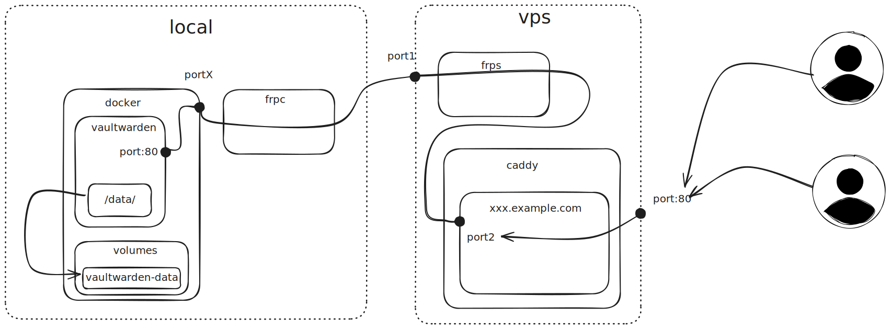

# 繁杂的密码

初中真正开始使用电脑开始，我就发现了设置密码 **是个麻烦事儿**，作为一个 `起名困难综合症患者`，整个靠谱好记的密码很难。随后就开始用上了一些 **辅助记忆** 的方法：

> 下面罗列的密码生成方式仅为例子，并不是我的个人密码的生成方式，评论区不用提示了

譬如：

> [!important] 谐音是个好方法！
> 飞流直下三千尺 -> flzx3kc

类似于这样，但是显然的我不可能每个网站都用 `同一个密码`，然后就得加一些拼接规则，这麻烦程度又上一层楼。

譬如你用上了百度，那就得来个 `flzx3kc-baidu-200x` 这样的方式才算得上安全，这样增加一下社工的成本也是好的。

> [!bug] 属于是太麻烦了
> 很快我就懒得去用这么麻烦的方案，转头就用上了 chrome 自动生成并记录密码。
 
毕竟有了密码本，只需要记一个 chrome 的密码就好了，着实省力。最终的 chrome 就成了我的密码本，差不多零零散散记录了约莫三百来个账号和密码。

至于说 **安全性**，我的看法是密码 **安全** 和 **便捷** 应该取一个 `中间态`。

1. 不要在不信任的设备上登录 chrome 账号
2. 保证使用 chrome 的设备足够安全
3. 使用 2fa 验证主账号，并且使用 2fa 的设备绝对不能丢失，且最好断网使用

在满足上面说的要求后，chrome 的密码本总体上是一个 *兼顾* **方便** 和 **安全** 的方案了，再不济咱们的主要账号也是 <u>有 2FA 的</u>，想偷重要账号的难度还是比较大的。

另外一点从大学开始我就没有丢失过我的移动设备了，所以两步验证码丢失的可能性就更低了一级别。

## 安全是相对的

> 密码安全是相对的

因为你不太可能做到绝对的密码安全，此前有看到很多抨击 chrome 没有提供 master key 的文章[^3]，并附文 firefox 有主密码一说。

我对此是 **略有不同意见的**，诚然 chrome **应当**向 firefox 学习提供一个主密码来防止非安全应用越界访问密码。

但是你要明白如果你的设备本身在一个非安全的情况下运行，黑客同学有大量别的手段获取你的密码例如：

+ https://github.com/moonD4rk/HackBrowserData 利用 cookie、localstorage 等身份凭证
+ 利用 hook 监听键盘，配合进程信息可以很方便获得你的密码，比如有个测试用的 [project](https://github.com/aydinnyunus/Keylogger ) , 当然自己写显然不会用 python

如果真的需要安全性拉满，你唯一的方法是像银行那样使用安全芯片，并且安全芯片是一个被隔离的外部的、物理设备例如：[yubikey](https://www.yubico.com/) 。

用的时候需要插入一下设备，还得设备支持才行，你要说方不方便吧？

> [!warning] 还凑合
> 但你丢钥匙的频率决定了 —— 你啥时候会丢光你的密码

如果没有提供其他验证手段，你这辈子就别想找回来了，而一旦引入其他验证手段就很有可能出现通过社会工程学绕过 MFA 的情况[^1][^2]，所以密码安全还得从机制上解决，比如非常用环境下执行操作需要高安全等级的验证手段。

# 更便利一点

> [!summary] 总结
> 个人的密码安全更多的需要维持一个平衡，**相对安全** 以及 **足够便捷**

所以我更换密码软件的最终原因，主要还是便捷性的区别，安全性并非首要因素。

chrome 的密码管理器的填充能力相对有限。

在过去的时间里面，我的设备相对比较少的情况下，chrome 的填充已经够用了，但是我现在设备很多，他们还是不同平台的，有 linux 、 有安卓、有苹果。safari 的密码显然用不了 chrome 的密码管理器的，而安卓端的 chrome 密码管理器的易用性也就一般。

而且多平台的同步用 chrome **不是一个非常方便**的事情，我 **总有** 网络情况不好的时候，也 **总有一些设备** 并不适合安装 chrome。

> [!help] 这是一个麻烦的事情
> 我希望能解决这个问题，如果顺带的能略微提升一下安全程度那就更好了。

我们公司里面的绝大部分同事都是用 1password ，据我所知的情况，1password 的自动填充能力非常不错，并且无论是跨设备同步、还是 UI 界面都挺漂亮的。定价上是我能接受的价格 —— 一个月3刀（约22块钱）。

如果能凑齐五人，可以最低 7元每月，年付70块钱，是一个很便宜的价格了。

不过有同事推荐我可以试试 bitwarden，如果只使用默认功能是免费的:


稍微高级一点的功能需要付费，价格比 1password 还要便宜，单人付费 1刀（七块钱）年付 10刀，70块钱，6人家庭售价一年40刀，人均 47块钱更便宜了。

> [!hint] 一个危险的事情
> 我确实没有使用过这两个软件的家庭版本，但是一般来说家庭组的创建人应该是有权利配置各子库的权限的，所以有没有可能通过家庭创建者添加自己进组来获得密码？

此外我看了看 github ，有个三方实现的 [服务端](https://github.com/dani-garcia/vaultwarden) 可以白嫖。

由于常用的密码管理器设计上都是 [端到端加密](../名词/端到端加密.md) 的，所以理论上服务端是可以在非安全的服务器上工作的。也就是说即使拿到了你的数据库文件的情况下，如果没有主密码，仍然没有有效的办法获得储存的密码本。

> [!danger] 坏消息
> 你要是真丢了主密码，那可啥都找不回来咯！

所以我打算用 vaultwarden 来搭建一下密码管理，本地管理的使用已经足够了，随后使用 [vaultwarden-backup](https://github.com/ttionya/vaultwarden-backup) 来备份密钥，最后使用 frp 穿透到公网，然后使用 cloudflare 提供公网访问的 SSL 证书，这样一般情况安全性也足够我使用了，速度也还不错。


当然，我建议比较专业的用户可以选择自行搭建 bitwarden并使用，且使用的时候一定要进行 [3-2-1备份原则](../名词/3-2-1备份原则.md) 。如果只是一个普通用户，选择 1password 或是直接用 bitwarden 的付费、免费服务都是可以的，***这里非常不推荐非专业用户自建此类服务***！

# 搭建

## 启动虚拟机

我家里使用的是 exsi 的虚拟机，添加一个新的 ubuntu server 即可，随后在 ubuntu 初始化中选择安装 docker 即可，他会自动安装 docker 和 docker-compose。

随后 ssh 并进入主目录, 创建一个 docker-compose 文件

```yaml {11,22}
version: '3.4'

services:

  vaultwarden:
    image: vaultwarden/server:latest
    restart: always
    environment:
      SIGNUPS_ALLOWED: 'false'
    ports:
      - '<portX>:80'
    volumes:
      - vaultwarden-data:/data/

  backup:
    image: ttionya/vaultwarden-backup:latest
    restart: always
    environment:
      RCLONE_REMOTE_NAME: 'BitwardenBackup'
      RCLONE_REMOTE_DIR: '/BitwardenBackup/'
      RCLONE_GLOBAL_FLAG: ''
      CRON: '5 * * * *'
    volumes:
      - vaultwarden-data:/bitwarden/data/
      - vaultwarden-rclone-data:/config/

volumes:
  vaultwarden-data:
    name: vaultwarden-data
  vaultwarden-rclone-data:
    external: true
    name: vaultwarden-rclone-data
```

最后直接 `docker-compose up -d`  即可，除此外，备份服务还需要添加一些配置文件：

```text
|-./vaultwarden-rclone-data
  |-./rclone
    |-./rclone.conf
```

配置备份服务，具体可以参考文档：我这边用的是 s3(阿里云  oss) 的配置

```toml {4,5,6}
[BitwardenBackup]
type = "s3"
provider = "Alibaba"
endpoint = "<x>"
access_key_id = "ACCESS_KEY_ID"
secret_access_key = "SECRET_ACCESS_KEY"
acl = "private"
storage_class = "Standard"
```

## 内网穿透

由于我没有公网 ip ，未来可能去配置一下，但是现在暂时使用内网穿透来工作，内网穿透的选项很多，譬如你可以选择使用 tailscale 或者 cloudflare zero trust 等等都可以，我这边选择直接将服务暴露到公网使用，最好的方案就是 frp。
### 安装 frpc

> 值得注意，我这里不建议使用 docker 安装 frpc ，因为这需要处理额外的网络问题。

```bash /0.60.0/
# 注意替换版本 0.60.0
wget https://github.com/fatedier/frp/releases/download/v0.60.0/frp_0.60.0_linux_amd64.tar.gz
tar zxvf frp_0.60.0_linux_amd64
```

随后修改配置文件, 其中都按照自己想要的填写即可，同样的我也不建议使用默认（也就是下方）提供的 port。

```toml title="frpc.toml" {3,4}
serverAddr = "127.0.0.1"
serverPort = "<port1>"
auth.method = "token"
auth.token = "<token>"

[[proxies]]
name = "test-tcp"
type = "tcp"
localIP = "127.0.0.1"
localPort = "<portX>"
remotePort = "<port2>"
```

#### 配置系统服务

你可以写一个  [service 服务](systemd.md) 来开机自启动项目，防止意外断电等情况

```ini title="/etc/systemd/system/frpc.service" {6} /frpc/
[Unit]
Description=frpc service
After=network.target

[Service]
ExecStart=</path/to/frpc> -c </path/to/frpc.toml>
Restart=on-failure

[Install]
WantedBy=multi-user.target
```

随后配置一下开机自启动

```bash /frpc/
# 刷新服务列表 
systemctl daemon-reload 
# 设置开机自启 
systemctl enable frpc.service 
# 启动服务 
systemctl start frpc.service
```
### 配置 frps

```toml {2}
[common]
bind_port = "<port1>"
token = "<token>"
```

#### 配置系统服务


```ini title="/etc/systemd/system/frps.service" {6} /frps/ 
[Unit]
Description=frps service
After=network.target

[Service]
ExecStart=</path/to/frps> -c </path/to/frps.toml>
Restart=on-failure

[Install]
WantedBy=multi-user.target

```

 [service 服务](systemd.md) 处理同上

```bash /frps/
# 刷新服务列表 
systemctl daemon-reload 
# 设置开机自启 
systemctl enable frps.service 
# 启动服务 
systemctl start frps.service
```

## 配置 caddy 转发

随后配置一下转发就好了，之前你配置的 frpc 的端口就是这边需要使用的端口

```ini
host {  
    reverse_proxy 127.0.0.1:<port2>
}
```

## 配置 cloudflare （可选）

随后你可以选择配置 cloudflare 以保护原站点，但切记务必开启 https，并且开启 https 严格模式，否则 caddy 不会正常工作。

# 总结

这样我们就搭建完成了 self-host 的 bitwarden， 整体的网络情况会是下面这样:




[^1]: https://blog.1password.com/files/okta-incident/okta-incident-report.pdf
[^2]: https://blog.cloudflare.com/zh-cn/how-cloudflare-mitigated-yet-another-okta-compromise/
[^3]: 现在 chrome 已经添加了[设备端加密](https://support.google.com/accounts/answer/11350823?sjid=9162198334134975117-AP) 但是这种防护手段有限，如果真的想保护，我建议可以使用各个杀软提供的目录保护功能，限制 chrome 存储目录只能由允许的软件访问，如 chrome 自己。