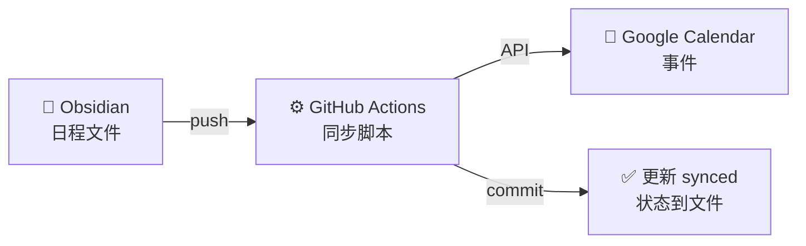

在日常工作中，我习惯用 Obsidian 记录各种待办事项和日程安排。问题是，这些日程只存在于笔记里，不会主动提醒我——我总是被别人提醒才想起来「哦对，那个会议」。

本来我是想找个现成的插件解决这事，但转念一想，我的 Obsidian 仓库本来就托管在 GitHub 上，日常通过 Git 同步，何不直接让 GitHub Actions 帮我同步到 Google Calendar？这样 push 一下就自动同步了，连插件都省了。

## 善用 AI，让 Cursor 来写

整套方案我完全交给 Cursor 了。给它的提示词很简单：

> 有没有办法支持通过这个里面的某个 markdown 配置同步更新到 google 账号的日历上？比如我写一个「1月4日需要做 xxx 事情」，能自动同步到日历。

它问了几个问题后，我又补充：

> 新建一个日程文件夹，里面放日程，格式改成正常 markdown，一个文件一个日程，用 frontmatter 存日期时间等数据。

然后它就开始干活了——Node.js 同步脚本、GitHub Actions workflow、甚至还写了一份 Cursor Rules 让它以后能按正确格式帮我创建日程文件。整个过程大概十几分钟，中间我只改了两三处细节，这里不贴代码了，建议你使用自己习惯的方式让 AI 去生成这块内容。由于 GitHub Actions 和 Google API 的 SDK AI 非常熟悉，所以生成出来的代码一般都是正确的（建议用 node api， 我试了几个语言， node 是唯一一个完全不用修改就能正确运行的，其余都需要微调）。



## 日程文件长什么样

每个日程是一个独立的 Markdown 文件，放在 `文档/日程/` 目录下。文件名我用 `YYYY-MM-DD-标题.md` 的格式，方便按时间排序。

一个全天事件大概长这样：

```markdown
---
date: 2025-01-20
title: 产品发布日
tags: [工作, 重要]
synced: false
---

## 详情

新版本正式发布上线。
```

如果是有具体时间的事件，加上 `time` 和 `endTime` 字段就行。时间值要用引号包起来，不然 YAML 解析会出问题——这个坑 Cursor 帮我踩过了：

```markdown
---
date: 2025-01-20
time: "14:00"
endTime: "15:30"
title: 项目评审会议
tags: [工作, 会议]
synced: false
---

## 详情

参与人员：产品、开发、测试
会议地点：3楼会议室A
```

`synced: false` 表示还没同步，push 到 GitHub 后 Actions 会跑脚本，同步成功就自动把它改成 `true`，还会填上一个 `calendarEventId` 方便后续更新。

不过一般情况下我们不会手动去修改这个文件，而是通过 AI 去生成和修改。

## Google Calendar API 那边

这部分稍微麻烦点，需要去 [Google Cloud Console](https://console.cloud.google.com/) 创建一个 Service Account，启用 Calendar API，然后把 JSON 密钥下载下来。

关键一步是要把你的日历共享给这个 Service Account（它本身没有日历），在 Google Calendar 设置里添加它的邮箱，权限给「Make changes to events」就行。

最后把 JSON 密钥和日历 ID 配到 GitHub Secrets 里，workflow 就能跑了。

> 上面这些内容如果你找不到配置的地方，也可以让 AI 指导你一步一步的配置，理论上支持 browser use 的 AI 都可以操作，但github & google console 配置是高风险项目，切记谨慎判断 AI 让你执行的操作是否正确。

## 用起来的感觉

现在我的工作流很简单：跟 Cursor 说「帮我建一个 1 月 20 号下午两点的项目评审会议」，或者贴一个 slack 链接，文档链接，或者让他访问页面去查看，它就会按照 Cursor Rules 里定义的格式自动创建好日程文件。还会贴心的生成好 commit 和 push 的命令，你去确认好点几个 approve，几秒钟后（实在感谢 GitHub 超高的 Actions 配置，简直不要太丝滑）—— Google Calendar 就有了，手机自动弹提醒。

## 延伸思考

这套东西做完之后，我突然意识到它和运维里的 **[Infrastructure as Code](../名词/Infrastructure%20as%20Code.md)** 很像——用配置文件描述状态，然后让自动化工具去同步到实际环境。

日程文件就是配置，GitHub Actions 就是执行器，Google Calendar 就是目标环境。这个思路其实可以扩展到很多地方：

- 用 Markdown 文件管理 TODO，同步到 Todoist 或者 Notion
- 用 frontmatter 记录阅读清单，同步到 Readwise 或者豆瓣
- 甚至可以反过来，把外部服务的数据拉回来写成 Markdown

本质上就是把笔记当成一个「配置中心」，所有数据都用 Markdown + frontmatter 描述，然后通过 Git 触发各种同步脚本。这样所有东西都在一个地方，版本可追溯，还能用 Cursor 帮忙生成和修改。

比专门的工具灵活，比纯手工管理省心，而且可以非常方便的让 AI 帮忙生成和修改。

## 附录：Google Calendar API 配额限制

Google Calendar API 完全免费，但有调用次数限制：

| 限制类型 | 默认配额 |
|---------|---------|
| 每个项目每日请求数 | 100,000 次 |
| 每 100 秒请求数 | 1,000 次 |
| 每 100 秒每用户请求数 | 100 次 |

对于笔记日程同步这种场景，这个配额绰绰有余——每天同步几十个日程完全不在话下。超出配额也不会产生费用，只是请求会被拒绝。

如果真的需要更高配额，可以在 [Google Cloud Console](https://console.cloud.google.com/) 里提交申请。
