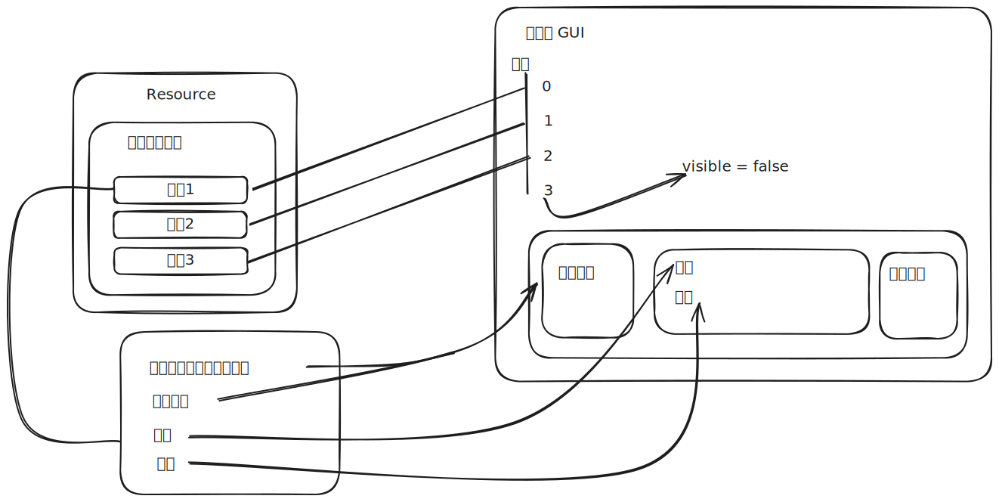

# 一个简单的对话框功能

在本文中将会使用下图的方式在 godot4.3 中使用 c# 实现一个简单的全局对话框。



在本文中将会涉及到：

+ 自定义 Resource  的使用
+ 绑定 GUI

# 设计思路

这里主要解决的就是存储数据的问题，一般来说我们会使用  csv 或者 json 的方式去储存对话内容列表。

这一次我们会使用一种比较简单的方式去存储数据，直接依靠 godot 自带的 Resource 功能来创建一个 tres 文件存储对话数据，并通过简单的绑定 GUI 实现。

## 创建相应的 Resource class

首先我们需要创建 一个 Dialogue 的 resource 用来存储单条对话内容，你可以通过 godot 创建也可以通过代码直接创建：

```csharp title="ResourceDialogue.cs" {2}
using Godot;  
[GlobalClass]  
public partial class ResourceDialogue : Resource  
{  
    [Export]  
    public string CharacterName;  
    [Export(PropertyHint.MultilineText)]  
    public string Content;  
    [Export]  
    public Texture2D Avatar;  
    [Export]  
    public bool IsLeft;  
}
```

这里特别需要注意的是必须要添加 GlobalClass 的 Attribute 这样才能在 godot 的列表中发现。

```csharp title="ResourceDialogueList.cs" {2}
using Godot;   
[GlobalClass]  
public partial class ResourceDialogueList : Resource  
{  
    [Export] public ResourceDialogue[] Dialogues;  
}
```

这样我们就创建好了对应的自定义文件，随后主界面点击构建按钮：


随后在任意目录新增一个资源：


 在搜索界面中搜索对应的 dialogue 即可，我们需要如下图所示中的 2 号资源。
 


随后我们通过双击新建的文件就可以在右侧开始编辑数据了：


## 新增 GUI 界面

新增 GUI 界面如下图所示，命名可以自行修改


界面如下图所示：


### 几个注意事项

#### HBoxContiner 在 BoxContainer 下不会自动撑开

你会碰到标题所示的问题，这种情况下可以在 HBoxContiner 上设置 size_flags_horizontal 中的填充为扩展：


#### 调整 margin

MarginContainer 的边距调整在 theme override 下：


#### 图片大小不正确会随意变化

如果图片大小不正确，说明图片的拉伸模式设置的不对，可以设置为 fit width 以及 keep Aspect center， 并设置最小宽度： 


### 编写 GUI 代码

gui 代码很简单，只需要在按空格和点击界面的时候切换 index 并设置到对应的 node 上即可：

```csharp
using Godot;
using System;
using System.Linq;

public partial class GuiDialogue : Control
{
    [Export] public ResourceDialogueList DialogueList;
    [Export] public int DialogueIndex = 0;
    [Export] public Label CharacterName;
    [Export] public RichTextLabel Content;
    [Export] public TextureRect RightAvatar;
    [Export] public TextureRect LeftAvatar;

    private void SetupDialogue()
    {
        var dialogues = DialogueList.Dialogues;
        if (dialogues.Count() > DialogueIndex)
        {
            CharacterName.Text = dialogues[DialogueIndex].CharacterName;
            Content.Text = dialogues[DialogueIndex].Content;
            if (dialogues[DialogueIndex].IsLeft)
            {
                LeftAvatar.Texture = dialogues[DialogueIndex].Avatar;
                RightAvatar.Texture = null;
            }
            else
            {
                LeftAvatar.Texture = null;
                RightAvatar.Texture = dialogues[DialogueIndex].Avatar;
            }
        }
        else
        {
            // 如果没有可以播放的就把自己隐藏了，也可以使用 QueueFree();
            Visible = false;
        }
    }
}
```

#### 设置点击 & 空格跳过

这里有两种做法：

1. 通过绑定节点 signal 来通知
2. 利用 `_UnhandledInput` 来处理

这里我们使用 `_UnhandledInput` , 只要没有正确消费的用户输入事件都会触发到他上面，因为本身来讲当对话框出现的时候，如果有其他 ui 元素响应了空格，点击 的情况下，不需要额外触发，所以这里理论上用 `_UnhandledInput` 是可以的,但是你需要额外在处理一下 mouse filter，来让所有非必要的 ui 元素忽视鼠标事件。


调整 ignore 或者 pass 都可, 随后编写代码

```csharp
using Godot;
using System;
using System.Linq;

public partial class GuiDialogue : Control
{
    [Export] public ResourceDialogueList DialogueList;
    [Export] public int DialogueIndex = 0;

    [Export] public Label CharacterName;
    [Export] public RichTextLabel Content;
    [Export] public TextureRect RightAvatar;
    [Export] public TextureRect LeftAvatar;

    public override void _Ready()
    {
        SetupDialogue();
    }

    private void SetupDialogue()
    {
        var dialogues = DialogueList.Dialogues;
        if (dialogues.Count() > DialogueIndex)
        {
            CharacterName.Text = dialogues[DialogueIndex].CharacterName;
            Content.Text = dialogues[DialogueIndex].Content;
            if (dialogues[DialogueIndex].IsLeft)
            {
                LeftAvatar.Texture = dialogues[DialogueIndex].Avatar;
                RightAvatar.Texture = null;
            }
            else
            {
                LeftAvatar.Texture = null;
                RightAvatar.Texture = dialogues[DialogueIndex].Avatar;
            }
        }
        else
        {
            Visible = false;
        }
    }

    public override void _UnhandledInput(InputEvent @event)// [!code focus]
    {// [!code focus]
        if (Input.IsActionPressed("pass_dialogue") || Input.IsActionPressed("ui_click"))// [!code focus]
        {// [!code focus]
            DialogueIndex++;// [!code focus]
            SetupDialogue();// [!code focus]
        }// [!code focus]
    }// [!code focus]
}
```
