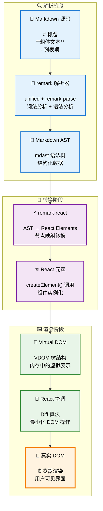

# 前言

2025年的大模型已经大面积的运用在各个搜索、提示的场景，我最近的工作也长期和大模型打交道。

同绝大部分 react 开发的 llm 前端不同，大部分 vue 的 llm 输出效果都差强人意，主要在于输出过程中大多数是无法点击，选中页面的。

核心问题在于绝大部分 vue 的前端开发者都会选用 inner html 的方式去渲染 markdown 的结果（例如通过 markdown-it 或是 marked）。而于此不同的是 react 通常会选用 remarkjs 原生对接 mdx 或是直接使用 **[react-markdown](https://github.com/remarkjs/react-markdown)**（基于 remark 生态）。

这其中就带来了巨大的差异。

# 为什么存在较大体验差距？

## 探索 react markdown

React Markdown 的处理流程相比 vue innerHTML 方式有着本质的不同：



这种基于 AST 的处理方式带来了以下优势：

1. **增量渲染** - 只更新变化的节点，而非通过 innerHTML 重新渲染整个内容
2. **组件化** - 每个 Markdown 元素都是独立的 React 组件，可以方便的进行样式和事件处理，而不是通过 onMounted 后置处理

带来的交互体验上有较大的优势：

- **保持交互性** - 流式输出过程中用户依然可以选择文本、点击链接
- **避免闪烁** - 不会因为 innerHTML 重置而导致页面重新布局
- **响应式更新** - 状态管理和事件系统

## 使用相同的思路改善 vue 的 markdown 渲染

首先，vue 在整个 markdown 的生态上有着较大的差距，同 react 的 remark 生态相比，vue 的生态较为混乱，没有形成统一的生态。

react 整个 markdown 社区从最上层的 mdx 生态，到中间的 remark 生态，再到最底层的 unified 生态，形成了完整的 ast 处理、渲染、组件化生态。

对于 react 开发者而言，只需要简单的使用库就能非常方便的用上较为先进的处理方案，而 vue 开发者则需要考虑的就多了。

首先 markdown 解析方面，如果对于既有的项目，你可能没有什么机会将整块处理更新为 mdast 方案，但是中间层的处理倒是比较容易剥离出来的。

这里我们仍然需要借助 unified 生态，处理 html 标签，并转换为 ast 树，然后通过 ast 生成 vnode 来实现同 react 的 remark 生态类似的方案(ast -> vdom)。

这里我们以 markdown-it 为例，来举一个具体的例子（当然你也可以手动解析 markdown-it 提供的 token ast 来实现，但泛用性上失去了 unified 生态的加持，你需要写很多 ast 相关的辅助方法，这里我们直接使用 unified 生态）：


```ts
// 假定我们有个流式的输入源码
const markdown = ref(`
# 标题
**粗体文本**
- 列表项
`);

const md = markdownit();

const html = md.render(markdown.value);

import { fromHtml } from 'hast-util-from-html';
const ast = fromHtml(html, {
  // 注意这里需要设置 fragment 为 true，否则会生成完整的 html 结构，而不是 fragment 结构
  fragment: true,
});
```

现在我们可以通过 ast 树来生成 dom 了，这里我们使用的是 vue3.3+，所以通过一些简单的变换操作就可以让 vue 兼容类似于 react 的 jsx 方案。

```ts
import { toJsxRuntime } from 'hast-util-to-jsx-runtime';

const vnode = toJsxRuntime(ast, {
  Fragment,
  jsx: jsx,
  jsxs: jsx,
  // 注意 vue 必须要使用 html 的属性名大小写，否则会报错
  elementAttributeNameCase: 'html',
  components: {
    // 这里可以添加自定义的 vue 组件来渲染页面
  }
});
```

然后我们需要实现一个 jsx 的转换函数，vue 官方在 `vue/jsx-runtime` [^1] 中提供了 jsx 的转换函数，但是这个函数实现上有一定的问题 [^2]，我们 copy 过来以后进行一定的改造：


```ts
import { Props } from 'hast-util-to-jsx-runtime';
import { Fragment, withCtx } from 'vue';
import { h, withCtx } from 'vue';

function jsx(type: any, props: Props, key?: string | undefined) {
  const { children } = props;
  delete props.children;
  if (arguments.length > 2) {
    props.key = key;
  }
  if (type === Fragment) {
    // fragment 需要特殊处理, 因为没有支持 default slot
    return h(type, props, children as any) as any as JSX.Element;
  }
  return h(type ?? 'div', props, {
    default: withCtx(() => children),
    // 视情况添加 $stable 标记
  }) as any as JSX.Element;
}
```

这样我们就完成了 vue 的 jsx 转换函数，现在我们可以通过 vnode 来渲染 dom 了。生成的 vnode 可以直接在 vue 上使用，我们新建一个组件来测试一下：

```tsx
function HTMLToVNode(props: { html: string }) {
  const ast = fromHtml(props.html, { fragment: true });
  const vnode = toJsxRuntime(ast, {
    Fragment,
    jsx: jsx,
    jsxs: jsx,
    elementAttributeNameCase: 'html',
  });
  return vnode;
}

<HTMLToVNode :html="html" />
```

由于我们生成的是 vnode，这样就可以自动的触发 vue 的 [虚拟dom](虚拟dom.md) 更新，自动 diff 并 patch dom。

如果你使用的是 vue2 的话，也可以使用类似的写法（处理成 scoped slot，并添加 fragment 库解决）。原生方案上 Snabbdom 是一个不错的选择。

# 相关阅读

+ [hast](https://github.com/syntax-tree/hast)
+ [hast-util-to-jsx-runtime](https://github.com/syntax-tree/hast-util-to-jsx-runtime)


[^1]: [vue-jsx-runtime](https://github.com/vuejs/core/blob/main/packages/vue/jsx-runtime/index.js)
[^2]: [Non-function value encountered for default slot. Prefer function slots for better performance.](https://github.com/mdx-js/mdx/issues/2512#issuecomment-2220985663)