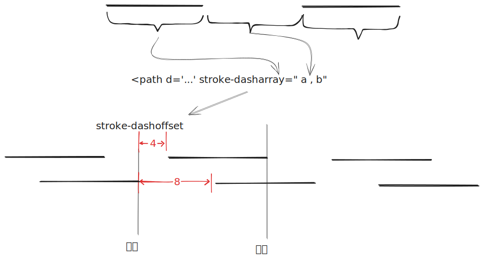

最近做了个倒计时按钮，顺便做个笔记记录一下。

# 思路 & 样子


按钮样式大致类似于上面的样子，进度条就是外面的黑色 border，逐渐减少。

## 不太可行的思路


首先第一个想到的思路就是利用 `conic-gradient` 绕着做旋转 [^1], 你可以参考引用的例子写一个 demo，但是实践下来是有问题的：


上图[^2]显示的 conic gradient 是一个派，也就是如果我们使用了遮罩来实现，那么出来的 border 肯定是一个斜边，这不太靠谱。

那 radial-gradient 能不能做？也是不行的，因为他如果在椭圆上切也是一个斜边，不符合要求。

## 试试 svg 

以往做动画的时候，还会考虑使用 svg 做曲线动画，那么理论上使用 stroke 也是可以做这个动画的，原理在于 stroke 支持 dash，且支持以 array 方式配置 dash, 而 svg 绝大部分都直接可以在 css 上进行配置，这样结合 animation 或者 transition 做动画极为方便。

### stroke-dasharray

stroke dasharray 是用来配置 stroke 时决定填充样式的[^3]。

```html
<svg viewBox="0 0 30 12" xmlns="http://www.w3.org/2000/svg">
  <style>
    line {
      stroke: black;
    }
  </style>
  <!-- No dashes nor gaps -->
  <line x1="0" y1="1" x2="30" y2="1" />

  <!-- Dashes and gaps of the same size -->
  <line x1="0" y1="3" x2="30" y2="3" stroke-dasharray="4" />

  <!-- Dashes and gaps of different sizes -->
  <line x1="0" y1="5" x2="30" y2="5" stroke-dasharray="4 1" />

  <!-- Dashes and gaps of various sizes with an odd number of values -->
  <line x1="0" y1="7" x2="30" y2="7" stroke-dasharray="4 1 2" />

  <!-- Dashes and gaps of various sizes with an even number of values -->
  <line x1="0" y1="9" x2="30" y2="9" stroke-dasharray="4 1 2 3" />

  <!-- Dashes starting with a gap -->
  <line x1="0" y1="11" x2="30" y2="11" stroke-dasharray="0 4 0" />
</svg>
```


他会是这个效果：


dash 是以间隔的方式重复填充线段的，当然仅仅使用 stroke-dasharray 并不能动起来，我们还需要配合 stroke-dashoffset[^4] 来实现 dash 的偏移，譬如我们设置1，则 dash 会朝着终点方向偏移1个单位。


利用这个两个特性配合 animation 我们就可以做一个倒计时按钮了。

例如下图这样，利用 stroke-dashoffset 的逐渐增加或者减小 我们就可以**营造**出一种线条走过的感觉。




### 获取 path 的长度

这样很重要的一点是需要将 stroke-dasharray 进行合理的设置，让显示线条的两侧变成足够长的空白，那么怎么知道这个 svg path 有多长呢？

在 svg 中所有继承自 `SVGGeometryElement`  对象都可以方便的通过 `getTotalLength` [^5]获取线条的总长度。

举个例子上图的半圆可以用 [svg-path-editor](https://yqnn.github.io/svg-path-editor/) [^6]， 快速的绘制出来：


代码差不多是这样的：

```text
m 100 1 
L 177 1 
A 1 1 90 0 1 177 47 
L 25 47 
A 1 1 90 0 1 25 1 
L 100 1 
Z
```

这样可以简单的通过如下代码获取到你需要的 stroke-dasharray 间隔：

```typescript
const path = '...'
const svgNs = 'http://www.w3.org/2000/svg';  
const dom = document.createElementNS(svgNs, 'path');  
dom.setAttribute('d', path);  
strokeLength.value = dom.getTotalLength();  
```

### css 动画

css 动画方面就比较简单的，如果你知道 dashoffset 可以直接填上去，如果是动态计算的，那么可以用 css 变量来实现。

```css
@keyframes stroke-animation {
  0% {
    stroke-dashoffset: var(--stroke-length-start);
  }
  100% {
    stroke-dashoffset: var(--stroke-length-end);
    stroke-width: 2;
    animation-timing-function: cubic-bezier(0.11, 0, 0.5, 0);
  }
}
```
# examples

万事俱备，我们下面是 [stackblitz 的预览链接](https://stackblitz.com/edit/svg-path-stroke-animation-j)

<iframe border="0" frameborder="0" height="600" width="100%" src="https://stackblitz.com/edit/svg-path-stroke-animation-j?ctl=1&embed=1&file=src%2Findex.tsx&hideExplorer=1" > </iframe>


[^1]: https://web.dev/articles/css-border-animations?hl=zh-cn
[^2]: https://developer.mozilla.org/en-US/docs/Web/CSS/gradient/conic-gradient
[^3]: 代码来自 https://developer.mozilla.org/en-US/docs/Web/SVG/Attribute/stroke-dasharray
[^4]: https://developer.mozilla.org/en-US/docs/Web/SVG/Attribute/stroke-dashoffset
[^5]: https://developer.mozilla.org/en-US/docs/Web/API/SVGGeometryElement/getTotalLength
[^6]: 也可以手写