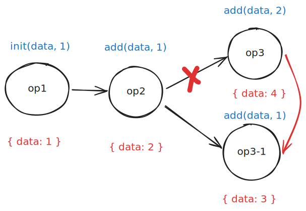
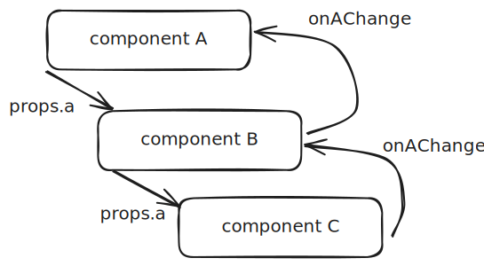
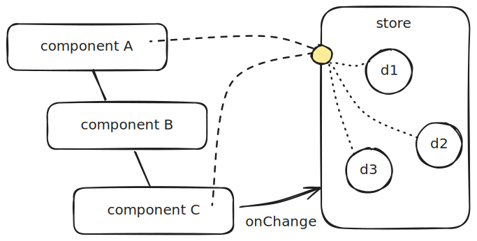

# 前言

状态管理库自数据驱动的前端框架诞生以来，一直都是一个 **颇具争议**，经常在社区吵闹非凡的话题。

本文并不想针对性的具体谈 *某个状态管理库的优劣*，而是打算从 [范式](../../名词/范式.md) 的角度去思考这些不同的框架之间的关系。

>[!attention] 特别注意
>如果你打算定向的看看某两个 状态管理 框架之间的**优劣**，说是<u>横向对比多个框架的优缺点</u>，那么本文并不适合你。

对此我们要搞懂的问题有下面几个：

1. 状态管理的是怎么诞生的
2. 为什么要有状态管理库
3. 他们期望解决什么问题。


# 旧时代

让我们把时钟拨回2015年，这是我想对较早接触前端的日子，更早一点的得追溯的高中了，当然那个时候也是 jquery 一统天下的日子。

在 jquery 时代，***不存在真正意义上的状态实践***，但是状态管理是<u>隐含存在的</u>。


```javascript
var $button = $('#button')
var $modal = $('#modal')
$button.on('click', function () {
  if ($(this).data('show')) {
    return
  }
  $modal.show();
  $(this).data('show', true)
});
```

例如上文就是在对 modal 的显示的 [伪代码](../伪代码.md) ，这种类似的操作会 **分散的** 排布在页面的各个角落。

你得承认他们是一种较为 **松散、单一、临时** 的状态管理，面对 **复杂、耦合** 的状态时会显得 *捉襟见肘*。

所以如果你混迹早期的 jquery 相关的论坛，经常可以看到对 form 表单校验的 *大量问题*。而如果你实际处理过一些至少 2014年乃至以前的代码的话，你会发现寻找一个表单项的值在何处声明、使用时一个 **极其困难** 的事情  —— 他们会分布在 `$().on` 包裹的各个角落。

> [!question] 核心问题
> 那么问题来了！状态管理的本质是什么？

在探讨这个问题前我们先看看局部的状态管理是怎么产生的。

# 局部状态管理的兴盛

有很多人会说自 vue react 起才诞生了 **真正意义上** 的前端状态管理，我个人对此说法并不赞同。至少在我的观念里面前端状态的管理远比这两个框架诞生的早。例如 backbone、knockoutjs、angularjs 都远远早于这两个框架，并且也颇为成熟。

他们都内置提供一个`“较小作用域”` 下的数据管理。例如 angular 使用的是一种类似于脏检查的手段，而 backbone 和 knockoutjs 则纯粹很多，都是 `基于发布订阅者模型` 实现的。

这些旧时代的遗老说实话对广大前端生态的冲击并没有这么大，我在 [虚拟dom](虚拟dom.md) 一文中就有介绍这些，自 react 将两大块拼图收集齐全以后才有了真正意义上的前端大面积落地，而前端的编程范式也从此发生了天翻地覆的改变。

用一个最简单的词汇描述就是 —— ***状态的映射产生了界面***，譬如 vue 、react 一个大的状态集对应一个界面。

$$ UI=fn(State)$$

简直就是天才一般的设计, 所以与其说是状态管理的开创者，不如说是推广大师。

基于这一思路诞生了 **非常有效的** 局部状态管理，使得在组件内的开发稳定、安全，<u>只要 state 是可控的</u>，那么最终 UI 展示<u>必然是可控的</u>。

> [!success] 更进一步
> 如果能原子化的将所有的状态按照时间线记录下来，就能将庞大的界面变化抽象为小规模的数据变化。




如果你玩过类似于 war3、sc 这样的游戏，并体验过他们的回放，就能理解这一行为的优势和缺陷，虽然最后的录像文件很小，但是必须依次重放才能获得某个时间点的数据。

而这一思路极大的影响了后来者 —— 中央数据管理。

## 局部状态管理的小小问题

在新时代，所有的框架大体上都是 **趋同的**，换而言之，大部分情况下，绝大部分框架从设计上都趋于使用 **单向数据流** 管理页面数据，单向处理的核心是为了 <u>防止通过多个来源直接的修改数据，使得修改来源不可追溯，且数据更新不稳定</u>。

譬如 react 中你只能通过一层一层传递的方式数据：





如果只有一个两个组件还好，但是现如今的应用往往都会膨胀到数百数千的组件。这样一层层的传递显然太过麻烦了，更何况事件响应 **往往不会** 设计为同步操作。

> [!bug] 听上去就让人感觉不安全
> 一个点击操作需要通过远超十层组件传递才能对点击做出响应。

所以事实上，单纯依靠组件的单向数据流只是 `看起来让数据变清楚` 了，但是对应到实践上是 `大相径庭` 的。

一个属性修改的事件要层层传递的结果，就是最后处理链一定会变成复杂的冗长的样板代码，你没有办法点对点的去处理这些 <u>互相有依赖关系</u> 的实体，你需要在庞大的代码树、组件树中查找响应的链路，并修改那个持有者，更麻烦的是，这个数据可能有多个爹[^4]。

> [!tip] 相信我
> 但凡处理过此类问题的同学，都会想提刀把设计这个方案的架构师送上断头台，毕竟本来只需要修改两个组件的事儿，现在需要顺着回调修改百来个，真是刺激！

那么会有相对更好一点的方案么？自然是有的，因为这同样也是一个 [单可信源](../单可信源.md) 问题，而 SSoT 问题的常用解决方案就是中心化数据源，自然中心化的状态管理方案应运而生。

# 中心化的状态管理

但凡提及中心化的状态管理库自然会提及 redux、mobx，如果是 vue 派系的自然还会提一手 vuex。

中心化的状态管理的好处是 **显而易见的**，在讨论范式的情况下我们不应该将各个框架的实现细节纳入考量，而应该去思考 ***本质是什么***，同时抛去框架本身的限制：

> [!note] 核心
> 将状态通过一个外置的关系，使得复杂层级间的组件可以直接地在相对较少的层级关系下互相访问：





至于说是哪一种状态处理框架，只是说关系形式上和写法上的区别，最关键的是使用了**较少的层级关系**[^1]。另外一个目的是让多个不同实体间[^2]可以正确的访问同一数据源，且当数据源更新后可以正确的反应这一更新。

早期的框架在设计上经常执着于实现 mutation 核心是为了实现上文提及的重放功能，最终实践表明，这只是无关紧要的一点，后续实现上绝大部分状态库都不依赖于此了。

# 新生代的状态管理


> [!success] 回归问题！
> 那么状态管理的本质是什么？
> + 单一数据源
> + 满足单向数据流


那么扩展到全局状态管理上，那么我们需要的是一致的：

+ 我们希望 `跨组件间的访问修改数据源是单一的`
+ 两个有实体关联的组件可以通过 `较短访问链` 互相关联
+ 这个数据源也能 `满足单向数据流`

而新生代的状态管理大多都是**基于此思路开发**，他们不但不满足于旧时代的写法的，还需要更强的类型、更友好的，更少的声明式写法，这对于状态管理的本身思路上**并无差距**。

例如：redux-toolkit 之于 redux、pinia 之于 vuex，其革新的目的都是在于更良好简单的 ts 类型推导，在减少低级错误[^3]同时减少了大量样板代码，减少理解成本。


[^1]:  如果 store 之间没有非常复杂繁琐的嵌套情况下，一般而言不会超过2层。
[^2]: 父子节点、兄弟节点，乃至更深层次的节点。
[^3]: 经常出现的拼写错误和传值错误、空错误等。
[^4]: 指多个对象持有了相同的数据源，当你更新其中的某一个时，另外的数据源不会更新