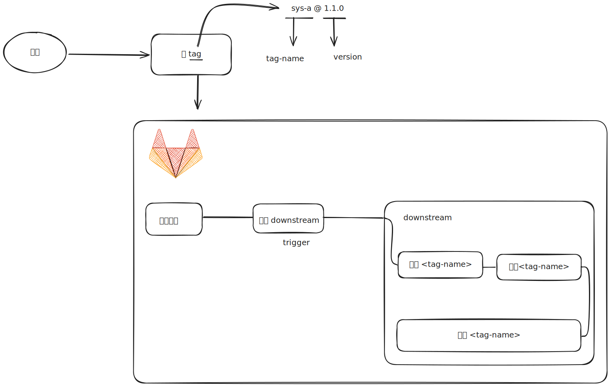

> 本文中涉及少量 excalidraw 绘图，目前暂时在 RSS 阅读器中无法查看，建议前往原站查看
# 前言

最近在整理项目的 CI/CD 配置，发现了项目中存在大量的配置文件重复，类似于下图这种结构：


结构上存在十多个项目具有完全一致的流程，但是他们的配置项都有点区别，主要在于目录上有一定的区别。这种重复的劳作在之前的 [文章](../../../archives/2024/mono%20项目最佳实践指南.md) 中就提过，对于一个 mono 项目来说，规模化效应是一个重要的指标，mono 项目高效的一个核心因素是项目中相同模式的方案能快速的应用在一个新的项目上。

所以这种重复劳作的 ci 配置是应该避免出现的，同时手工编码这些流程难免容易出错，且在 gitlab 的 pipeline 视图上，会显示的尤为复杂难以阅读。基于这一点，维护者应当尽可能的将这种部署模式寻找一个通用的解决方案，例如将这种 ci 配置变成一种约定。

# gitlab 官方提供的一些方案

gitlab 对于 pipeline 的管理提供了一些其他的管理措施：

1. 基于 trigger 做分离，这个一般在 [polyrepo](../../名词/polyrepo.md) 使用的更多一点 -> [文档](https://docs.gitlab.com/ee/ci/triggers/)
2. 基于 downstream pipeline 做分离，这个适合在单一仓库执行，[monorepo](../../名词/monorepo.md) 中是个不错额选择 -> [文档](https://docs.gitlab.com/ee/ci/pipelines/downstream_pipelines.html)

> [!caution] 备注
> 对于第二种其实很多不同的策略可以使用，如果你希望通过更灵活的方式去实现，那么 [动态生成 child pipeline](https://docs.gitlab.com/ee/ci/pipelines/downstream_pipelines.html#dynamic-child-pipelines) 是一个非常有效的方案，本文也会基于动态生成方案实践。


## 实践

由于 system 相关的部署配置大致是相似的，类似于下面这种代码：

> [!tip] 下方样例代码已脱敏, 有减少流程步骤且均为伪代码，可能无法正确执行

```yaml /sys-a/ /sys_a/
include:
  - xxx.common.mixin.yml

# 构建线上
sys_a构建线上:
  stage: build
  interruptible: true
  only:
    - tags
  extends:
    - .mix-dep
  script:
    - pnpm run build:production --filter=@taptap/sys-a
  cache:
    - key: "PnpmStoreCacheKey"
      policy: pull-push
      paths:
        - .pnpm-store

sys_a部署:
  when: manual
  stage: deploy
  needs:
    - sys_a构建线上
  only:
    - tags
  extends:
    - .mix-dep
    - .mix_prod_deploy
  variables:
    SRC_PATH:  /sys-a/dist
    DEST_PATH: /sys-a/
```


上文中的代码移除了关于 rule 的配置，在流程上应该通过打 tag 的方式来启动部署，类似于 `sys-a@1.0.0` 。

所以我们需要一个构建上述 yaml 的脚本，并通过 downstream trigger 来触发。



```yaml
动态创建:  
  stage: build  
  rules:  
    - if: '$CI_COMMIT_TAG =~ /^sys-.*/'  
  extends:  
    - .mix-dep  
  script:  
    - zx .gitlab/system-build.mjs  
  artifacts:  
    paths:  
      - tmp/auto-deploy.yml

触发downstream:
  stage: trigger
  needs:
    - 动态创建
  rules:
    - if: '$CI_COMMIT_TAG =~ /^sys-.*/'
  trigger:
    include:
      - artifact: tmp/auto-deploy.yml
        job: 动态创建
```

然后我们就需要编写一个 `system-build` 的脚本来创建 downstream pipeline 的代码，这块你可以用任何脚本实现，譬如：bash、python、node 等，取决你的项目。


代码类似于下面这样（伪代码）：

```js
import fs from 'fs';
const tag = process.env.CI_COMMIT_TAG;
const [tagName, version] = tag.split('@')
const jobName = tagName.replace(/-/g, '_') + '__' + version.replace(/[-\.]/g, '_');
const template = `include:
  - xxx.common.mixin.yml

# 构建线上
${jobName}构建线上:
  stage: build
  interruptible: true
  only:
    - tags
  extends:
    - .mix-dep
  script:
    - pnpm run build:production --filter=@taptap/${tagName}
  cache:
    - key: "PnpmStoreCacheKey"
      policy: pull-push
      paths:
        - .pnpm-store

${jobName}部署:
  when: manual
  stage: deploy
  needs:
    - ${jobName}构建线上
  only:
    - tags
  extends:
    - .mix-dep
    - .mix_prod_deploy
  variables:
    SRC_PATH:  /${tagName}/dist
    DEST_PATH: /${tagName}/
`
fs.writeFileSync(target, template);
```

> [!caution] 注意
> 这里建议在生成 pipeline 时对项目进行必要的检测，例如名称是否规范、要构建的项目是否存在等，并输出错误，辅助使用者判断问题。


